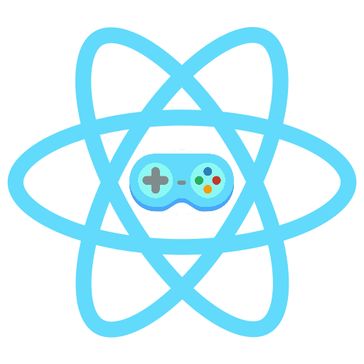

  

<h1 align="center">
  React Games List
</h1>
## Live site: https://react-games-list.web.app/

## About

React Games List is an app inspired by MyAnimeList where you can search from a database of games, add the ones you have played to your own personal list, and rate them from 1 to 10.

## Available Scripts

### If you clone

Run `npm install` to get the proper required node modules.

In the project directory, you can run:

### `npm start`

Runs the app in the development mode. 
Open [http://localhost:3000](http://localhost:3000) to view it in the browser.

The page will reload if you make edits. 
You will also see any lint errors in the console.
